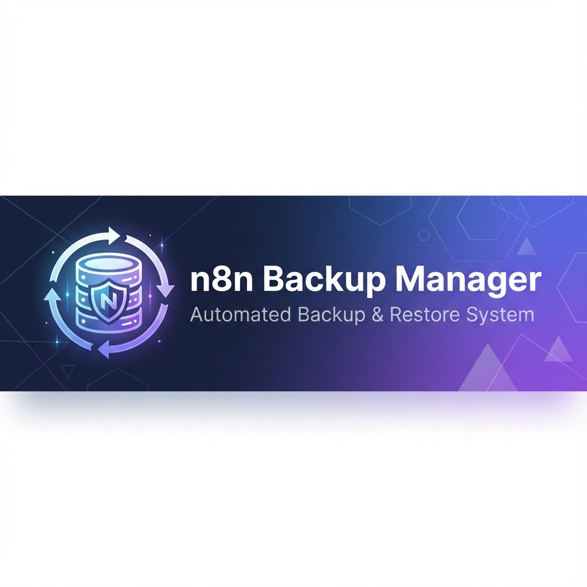
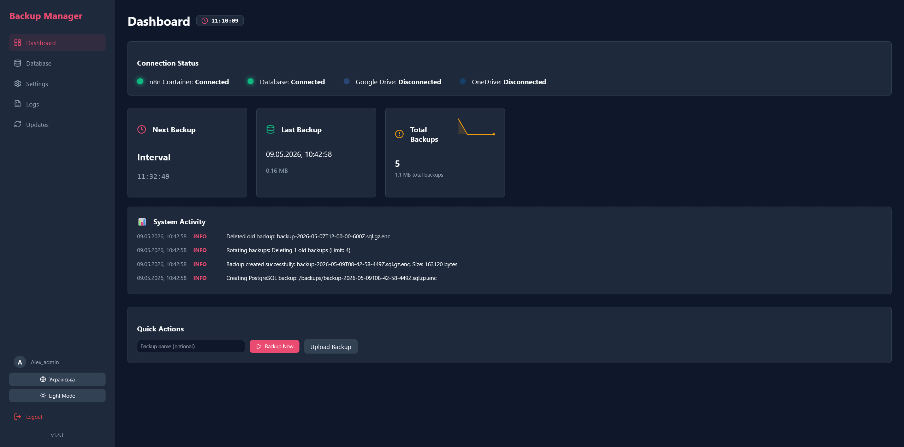
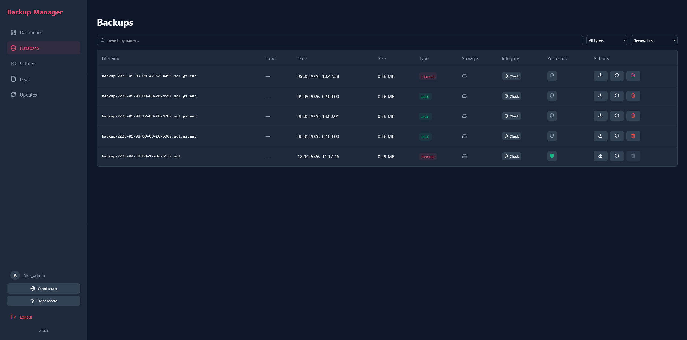
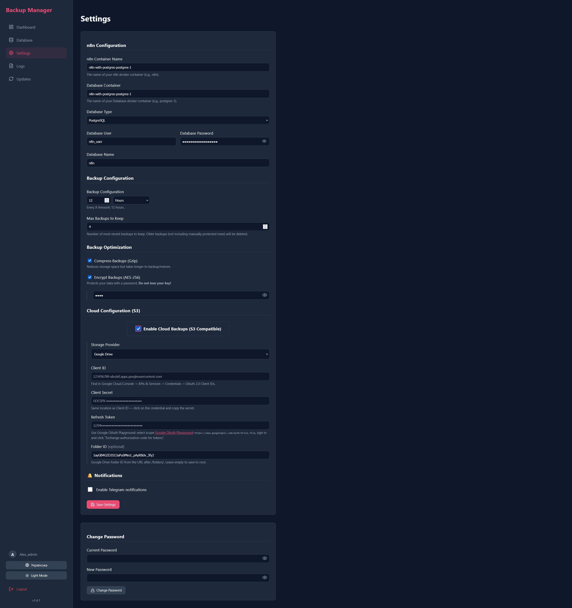
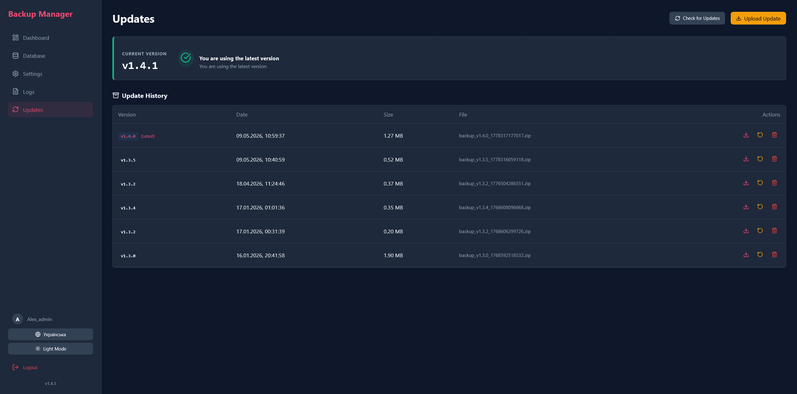
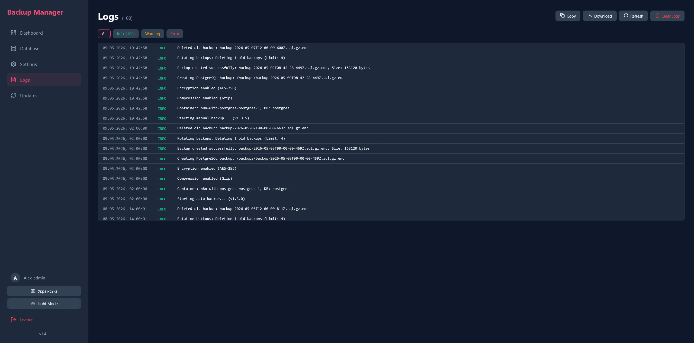

# n8n Backup Manager v1.4.1

<div align="center">



[](https://stand-with-ukraine.pp.ua)


**Automatic backup and restore system for n8n**

[Features](#-features) • [Platform Support](#️-platform-support) • [Installation](#️-installation) • [Usage](#-usage) • [Updates](#-update-system) • [Screenshots](#-screenshots) • [🇺🇦 Українська версія](README.ua.md)

### 🙏 Acknowledgements
*This section will be used to thank contributors and advisors who help improve this project.*

</div>

---

## 🚀 Features

### Core
- ✅ **Automatic Backup** of n8n workflows and database
- ✅ **PostgreSQL & SQLite Support**
- ✅ **Backup Compression** (Gzip)
- ✅ **Backup Encryption** (AES-256)
- ✅ **Flexible Scheduling** (intervals or cron expression)
- ✅ **Backup Retention Policy** (auto-delete old backups)
- ✅ **One-Click Backup & Restore**
- ✅ **Protected Backups** (prevent auto-deletion)
- ✅ **Custom Backup Labels** (name your backups on creation)

### Cloud Storage
- ✅ **S3 Compatible** (AWS, MinIO, DigitalOcean Spaces)
- ✅ **Google Drive** (OAuth2: Client ID + Secret + Refresh Token)
- ✅ **Microsoft OneDrive** (OAuth2: Client ID + Secret + Refresh Token)

### Monitoring & Notifications
- ✅ **Telegram Notifications** — alerts on backup success/failure
- ✅ **Backup Size Sparkline** — visual trend chart on Dashboard
- ✅ **Backup Integrity Check** — validate archive health *(Linux only — see below)*
- ✅ **Connection Status Monitoring**
- ✅ **Detailed Logging**

### Interface & UX
- ✅ **Web Interface** — responsive, mobile-friendly
- ✅ **Dark / Light Theme**
- ✅ **Multilingual** — English 🇬🇧 and Ukrainian 🇺🇦
- ✅ **PWA Support** — installable as a desktop/mobile app
- ✅ **Password Management**

### System
- ✅ **Automatic Update System** from GitHub
- ✅ **Rollback** capability

---

## 🖥️ Platform Support

This app runs on **Linux** (recommended for production) and **Windows/macOS** (for local development). Most features work on all platforms, but some require Linux-specific tools:

| Feature | Linux 🐧 | Windows 🪟 / macOS 🍎 |
|---|:---:|:---:|
| Backup (PostgreSQL / SQLite) | ✅ | ✅ |
| Restore | ✅ | ✅ |
| Compression & Encryption | ✅ | ✅ |
| Cloud Upload (S3 / GDrive / OneDrive) | ✅ | ✅ |
| Telegram Notifications | ✅ | ✅ |
| **Backup Integrity Check** (`tar`) | ✅ | ❌ *hidden automatically* |
| Auto-Update via GitHub | ✅ | ✅ |
| PWA Install | ✅ | ✅ |

> [!NOTE]
> **Integrity Check** uses the system `tar` command to verify archive health. On Windows/macOS the feature is automatically hidden — no configuration needed.

> [!TIP]
> **Running locally on Windows or macOS?** See the **[Local Development Guide](LOCAL_SETUP.md)** (or [🇺🇦 Ukrainian](LOCAL_SETUP.ua.md)) for step-by-step setup with Node.js + npm, without Docker.

---

## 📸 Screenshots

### Dashboard

*Main dashboard with system status, backup size trend, and quick actions*

### Backups

*Backup management: view, download, restore, integrity check*

### Settings

*Connection settings, cloud providers, Telegram notifications*

### Updates

*Automatic update system from GitHub*

### Logs

*Detailed system logs*

---

## 📋 Requirements

- Docker & Docker Compose
- n8n running in a Docker container
- PostgreSQL or SQLite database
- Minimum 1 GB free space for backups

---

## 🛠️ Installation

### Quick Start (Linux / VPS — Recommended)

1. **Download the latest release:**
   ```bash
   wget https://github.com/aleksnero/n8n-backup-manager/releases/latest/download/release.zip
   unzip release.zip
   cd n8n-backup-manager
   ```

2. **Start with Docker Compose:**
   ```bash
   docker compose up -d
   ```

> [!NOTE]
> If you are using a reverse proxy like **Nginx Proxy Manager**, ensure that this container is in the same network, or add the proxy network to the `docker-compose.yml` file. By default, the example above includes `npm_public` network.

3. **Open in Browser:**
   ```
   http://localhost:3000
   ```

4. **First Time Setup:**
   - Click "First Time Setup"
   - Create an admin account (username & password)
   - Log in

---

### Local Development (Windows / macOS)

> [!TIP]
> See the full **[Local Development Setup Guide](LOCAL_SETUP.md)** (or [🇺🇦 Ukrainian](LOCAL_SETUP.ua.md)) for detailed step-by-step instructions.

**Quick summary:**

```bash
# 1. Clone
git clone https://github.com/aleksnero/n8n-backup-manager.git
cd n8n-backup-manager

# 2. Install all dependencies
npm run install:all

# 3. Configure environment (Windows PowerShell)
Copy-Item .env.example .env

# 4. Start dev servers
npm run dev
```

Open **http://localhost:5173** in your browser.

> [!NOTE]
> Default credentials on first local run: **admin / admin**. Change your password in **Settings → Change Password**.

---

### Advanced Installation (Clone + Docker)

```bash
git clone https://github.com/aleksnero/n8n-backup-manager.git
cd n8n-backup-manager
```

Create a `.env` file (see `.env.example`):

```env
PORT=3000
JWT_SECRET=your_secret_key_here
```

```bash
docker-compose up -d --build
```

---

## 📖 Usage

### Connection Settings

Go to **Settings** and configure:

**For Docker:**
- **n8n Container Name**: Name of your n8n container
- **Database Container Name**: Name of your DB container (e.g., `postgres-1`)
- **Database Type**: PostgreSQL or SQLite

**For PostgreSQL:**
- **Database User**: username
- **Database Password**: password
- **Database Name**: database name

**For SQLite:**
- **Database Path**: path to DB file (e.g., `/home/node/.n8n/database.sqlite`)

**Backup Optimization:**
- **Compression**: Enable Gzip compression to save space
- **Encryption**: Secure your backups with AES-256 (Password required)

---

### Cloud Configuration

Go to **Settings → Cloud** and choose a provider:

| Provider | Fields required |
|---|---|
| **S3 Compatible** | Endpoint, Region, Bucket, Access Key, Secret Key |
| **Google Drive** | Client ID, Client Secret, Refresh Token, Folder ID *(optional)* |
| **Microsoft OneDrive** | Client ID, Client Secret, Refresh Token |

**Getting Google Drive credentials:**
1. Go to [Google Cloud Console](https://console.cloud.google.com/) → APIs & Services → Credentials
2. Create an **OAuth 2.0 Client ID** (type: Desktop app)
3. Use [Google OAuth Playground](https://developers.google.com/oauthplayground) with scope `https://www.googleapis.com/auth/drive.file` to get a **Refresh Token**

**Getting OneDrive credentials:**
1. Go to [Azure Portal](https://portal.azure.com/) → App registrations → New registration
2. Add `Files.ReadWrite` under Microsoft Graph API permissions
3. Use [Microsoft Graph Explorer](https://developer.microsoft.com/en-us/graph/graph-explorer) to generate a **Refresh Token**

> [!TIP]
> **[View Detailed Cloud Setup Guide](CLOUD_SETUP.md)** for complete step-by-step instructions.

---

### Telegram Notifications

Go to **Settings → Notifications**:

1. Enable Telegram notifications
2. Enter your **Bot Token** and **Chat ID**.
3. Click **Send Test Message** to verify the connection.

> [!TIP]
> **[View Detailed Telegram Setup Guide](TELEGRAM_SETUP.md)** for step-by-step instructions on creating a bot and getting your Chat ID.

---

### Scheduling

- **Backup Schedule**: select interval (hours/minutes) or cron expression
- **Max Backups to Keep**: number of most recent backups to retain (excluding protected ones)

---

### Creating Backups

**Automatic:**
- Backups run on the configured schedule.

**Manual:**
1. Go to **Dashboard** or **Backups**.
2. Click **Create Backup**.
3. Optionally enter a **label** (custom name) for this backup.
4. Wait for completion.

---

### Backup Integrity Check *(Linux only)*

Verify that a backup file is not corrupted before restoring it.

1. Go to **Backups**.
2. Click the **shield icon** next to any backup.
3. The system runs `tar --list` (for `.tar.gz`) or file size validation (for `.sql`).
4. Result: ✅ OK / ❌ Corrupt / ⚠️ Linux only

> [!NOTE]
> This feature is only available on Linux. On Windows/macOS the button is not shown.

---

### Restoring

1. Go to **Backups**.
2. Find the desired backup.
3. Click **Restore**.
4. Confirm the action.
5. Wait for restoration to complete.

---

## 🔄 Update System

Backup Manager supports automatic updates from GitHub:

1. Go to **Updates** → **Check for Updates**.
2. If a new version is available, release notes are shown.
3. Click **Apply Update** → Confirm.
4. System will: create a rollback snapshot → download update → apply → restart server.

### Rollback

If issues occur after an update:
1. Go to **Updates**.
2. Click **Rollback**.
3. System restores the previous version.

---

## 🐳 Docker Compose

Example `docker-compose.yml`:

```yaml
services:
  backup-manager:
    build: .
    container_name: n8n-backup-manager
    restart: unless-stopped
    ports:
      - "${PORT:-3000}:${PORT:-3000}"
    volumes:
      - /var/run/docker.sock:/var/run/docker.sock
      - ./backups:/app/backups
      - ./data:/app/data
    environment:
      - PORT=${PORT:-3000}
      - JWT_SECRET=${JWT_SECRET:-change_this_secret}
    networks:
      - default
      - npm_public

networks:
  npm_public:
    external: true
    name: nginx_proxy_manager_default
```

---

## 🔧 Configuration

### Environment Variables

| Variable | Description | Default |
|----------|-------------|---------|
| `JWT_SECRET` | Secret key for JWT | `secret-key` |
| `UPDATE_SERVER_URL` | URL for update checks | GitHub URL |
| `PORT` | Server port | `3000` |

### Volumes

| Volume | Description |
|--------|-------------|
| `/var/run/docker.sock` | Docker access for container management |
| `./backups` | Backup storage |
| `./data` | SQLite database |

---

## 📊 Tech Stack

- **Backend**: Node.js, Express
- **Frontend**: React, Vite
- **Database**: SQLite (Sequelize ORM)
- **Docker**: Dockerode
- **Scheduler**: node-cron
- **Authentication**: JWT
- **Notifications**: node-fetch (Telegram Webhook)

---

## 🤝 Contribution

Pull requests are welcome! For major changes, please open an issue first.

1. Fork the Project
2. Create your Feature Branch (`git checkout -b feature/AmazingFeature`)
3. Commit your Changes (`git commit -m 'Add some AmazingFeature'`)
4. Push to the Branch (`git push origin feature/AmazingFeature`)
5. Open a Pull Request

---

## 📝 License

MIT License - see [LICENSE](LICENSE) for details

---

## 💬 Discussions

Have questions or ideas? Join [GitHub Discussions](https://github.com/aleksnero/n8n-backup-manager/discussions)!

- 💡 **Ideas** - suggest new features
- ❓ **Q&A** - get help from community
- 📢 **Announcements** - stay updated
- 🎉 **Show and tell** - share how you use Backup Manager

## 🆘 Support

If you encounter issues:

1. Check [Issues](https://github.com/aleksnero/n8n-backup-manager/issues)
2. Create a new Issue with detailed description
3. Attach logs from `docker-compose logs`

## 🔗 Links

- **GitHub**: https://github.com/aleksnero/n8n-backup-manager
- **Releases**: https://github.com/aleksnero/n8n-backup-manager/releases
- **Issues**: https://github.com/aleksnero/n8n-backup-manager/issues
- **Local Dev Guide**: [LOCAL_SETUP.md](LOCAL_SETUP.md) | [🇺🇦 UK](LOCAL_SETUP.ua.md)

## 🙏 Acknowledgements

Made for the n8n community with ❤️

---

<div align="center">

**[⬆ Back to Top](#n8n-backup-manager)**

</div>
