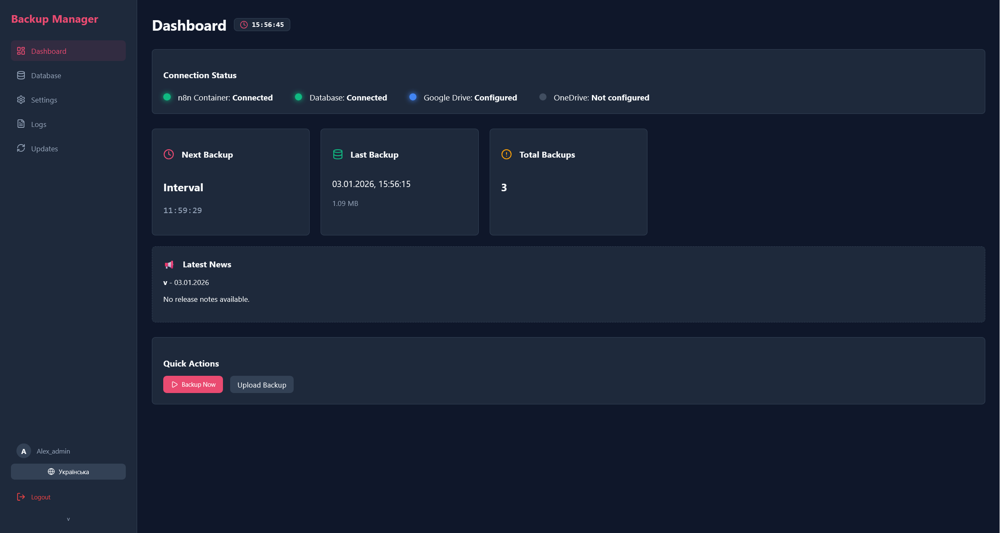
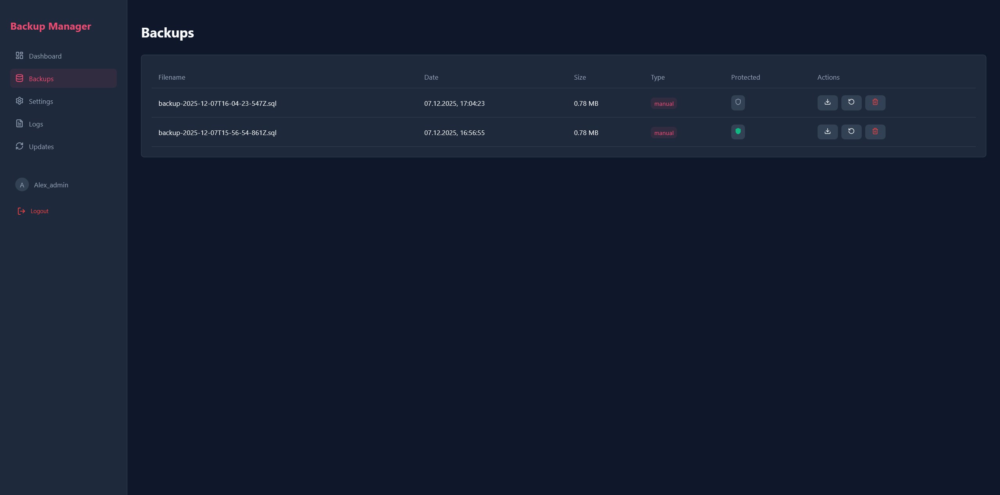
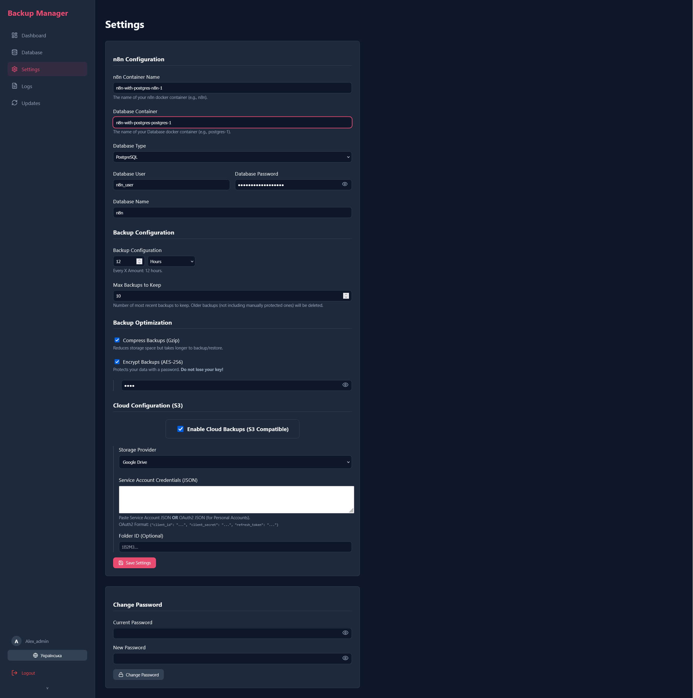
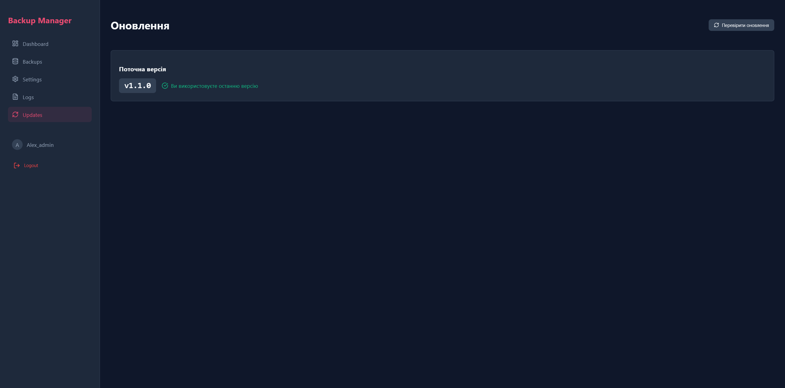
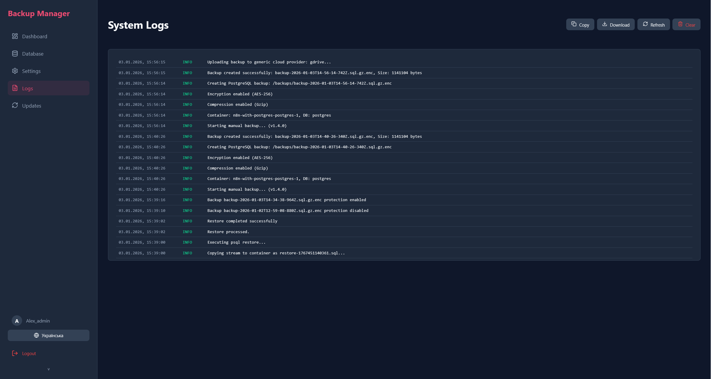

# n8n Backup Manager v1.4.1

<div align="center">


[](https://stand-with-ukraine.pp.ua)


**Автоматична система резервного копіювання та відновлення для n8n**

[Особливості](#-особливості) • [Підтримка ОС](#️-підтримка-ос) • [Встановлення](#️-встановлення) • [Використання](#-використання) • [Оновлення](#-система-оновлень) • [Скріншоти](#-скріншоти) • [🇬🇧 English version](README.md)

### 🙏 Подяки
*Цей розділ буде використано для подяки людям, які допомагають розвивати проект своїми порадами та звітами про помилки.*

</div>

---

## 🚀 Особливості

### Основні
- ✅ **Автоматичне резервне копіювання** n8n та бази даних
- ✅ **Підтримка PostgreSQL та SQLite**
- ✅ **Стиснення бекапів** (Gzip)
- ✅ **Шифрування бекапів** (AES-256)
- ✅ **Гнучке планування** (інтервали або cron-вираз)
- ✅ **Політика зберігання** (авто-видалення старих)
- ✅ **Завантаження та відновлення** одним кліком
- ✅ **Захист важливих бекапів** від автоматичного видалення
- ✅ **Власні назви (Labels)** при створенні бекапів

### Хмарні сховища
- ✅ **S3 Compatible** (AWS, MinIO, DigitalOcean Spaces)
- ✅ **Google Drive** (OAuth2: Client ID + Secret + Refresh Token)
- ✅ **Microsoft OneDrive** (OAuth2: Client ID + Secret + Refresh Token)

### Моніторинг та Сповіщення
- ✅ **Telegram Сповіщення** — повідомлення про успішні бекапи чи помилки
- ✅ **Графік розміру бекапів** — візуальний тренд на головному екрані
- ✅ **Перевірка цілісності бекапу** — валідація архіву *(тільки Linux — див. нижче)*
- ✅ **Моніторинг статусу підключення**
- ✅ **Детальне логування**

### Інтерфейс та UX
- ✅ **Веб-інтерфейс** — адаптивний та мобільний
- ✅ **Темна / Світла тема**
- ✅ **Багатомовність** — Англійська 🇬🇧 та Українська 🇺🇦
- ✅ **Підтримка PWA** — можна встановити як додаток на ПК або смартфон
- ✅ **Управління паролем**

### Система
- ✅ **Система автоматичного оновлення** з GitHub
- ✅ **Rollback** до попередніх версій

---

## 🖥️ Підтримка ОС

Програма працює на **Linux** (рекомендовано для серверів) та **Windows/macOS** (для розробки). Більшість функцій працюють всюди, але деякі вимагають Linux:

| Функція | Linux 🐧 | Windows 🪟 / macOS 🍎 |
|---|:---:|:---:|
| Бекап (PostgreSQL / SQLite) | ✅ | ✅ |
| Відновлення | ✅ | ✅ |
| Стиснення та Шифрування | ✅ | ✅ |
| Хмарні сховища (S3 / GDrive / OneDrive) | ✅ | ✅ |
| Telegram Сповіщення | ✅ | ✅ |
| **Перевірка цілісності бекапу** (`tar`) | ✅ | ❌ *приховано автоматично* |
| Авто-оновлення через GitHub | ✅ | ✅ |
| Встановлення PWA | ✅ | ✅ |

> [!NOTE]
> **Перевірка цілісності** використовує системну команду `tar` для валідації архівів. На Windows/macOS ця функція автоматично ховається з інтерфейсу.

> [!TIP]
> **Запускаєте локально на Windows або macOS?** Дивіться **[Інструкцію з локального запуску](LOCAL_SETUP.ua.md)** для налаштування Node.js + npm без Docker.

---

## 📸 Скріншоти

### Dashboard

*Головна сторінка зі статусом, графіком розміру бекапів та швидкими діями*

### Backups

*Управління бекапами: перегляд, завантаження, відновлення, перевірка цілісності*

### Settings

*Налаштування підключення, хмарних провайдерів, Telegram сповіщень*

### Updates

*Система автоматичного оновлення з GitHub*

### Logs

*Детальні логи системи*

---

## 📋 Вимоги

- Docker та Docker Compose
- n8n запущений у Docker контейнері
- PostgreSQL або SQLite база даних
- Мінімум 1 GB вільного місця для бекапів

---

## 🛠️ Встановлення

### Швидкий старт (Linux / VPS — Рекомендовано)

1. **Завантажте останній реліз:**
   ```bash
   wget https://github.com/aleksnero/n8n-backup-manager/releases/latest/download/release.zip
   unzip release.zip
   cd n8n-backup-manager
   ```

2. **Запустіть через Docker Compose:**
   ```bash
   docker compose up -d
   ```

> [!NOTE]
> Якщо ви використовуєте реверс-проксі, як-от **Nginx Proxy Manager**, переконайтеся, що цей контейнер знаходиться в тій самій мережі, або додайте мережу проксі до файлу `docker-compose.yml`. За замовчуванням у прикладі вище додано мережу `npm_public`.

3. **Відкрийте браузер:**
   ```
   http://localhost:3000
   ```

4. **Перше налаштування:**
   - Натисніть "First Time Setup"
   - Створіть адміністратора (логін та пароль)
   - Увійдіть у систему

---

### Локальна розробка (Windows / macOS)

> [!TIP]
> Детальну інформацію дивіться в **[Інструкції з локального запуску](LOCAL_SETUP.ua.md)**.

**Короткий зміст:**

```bash
# 1. Клонувати репозиторій
git clone https://github.com/aleksnero/n8n-backup-manager.git
cd n8n-backup-manager

# 2. Встановити залежності
npm run install:all

# 3. Налаштувати змінні (Windows PowerShell)
Copy-Item .env.example .env

# 4. Запустити dev сервер
npm run dev
```

Відкрийте **http://localhost:5173** у браузері.

> [!NOTE]
> Дефолтні доступи при першому запуску: **admin / admin**. Одразу змініть пароль у **Settings → Change Password**.

---

### Детальне встановлення (Клонування)

```bash
git clone https://github.com/aleksnero/n8n-backup-manager.git
cd n8n-backup-manager
```

Створіть файл `.env` (див. `.env.example`):

```env
PORT=3000
JWT_SECRET=your_secret_key_here
```

```bash
docker-compose up -d --build
```

---

## 📖 Використання

### Налаштування підключення

Перейдіть у розділ **Settings** та вкажіть:

**Для Docker:**
- **n8n Container Name**: назва контейнера з n8n
- **Database Container Name**: назва контейнера з БД (наприклад, `postgres-1`)
- **Database Type**: PostgreSQL або SQLite

**Для PostgreSQL:**
- **Database User**: ім'я користувача
- **Database Password**: пароль
- **Database Name**: назва бази даних

**Для SQLite:**
- **Database Path**: шлях до файлу БД (наприклад, `/home/node/.n8n/database.sqlite`)

**Оптимізація бекапів:**
- **Стиснення (Gzip)**: зменшує розмір файлів
- **Шифрування (AES-256)**: захист даних паролем

---

### Хмарні налаштування

Перейдіть у **Settings → Cloud** і оберіть провайдера:

| Провайдер | Необхідні поля |
|---|---|
| **S3 Compatible** | Endpoint, Region, Bucket, Access Key, Secret Key |
| **Google Drive** | Client ID, Client Secret, Refresh Token, Folder ID *(необов'язково)* |
| **Microsoft OneDrive** | Client ID, Client Secret, Refresh Token |

**Отримання ключів Google Drive:**
1. Відкрийте [Google Cloud Console](https://console.cloud.google.com/) → APIs & Services → Credentials
2. Створіть **OAuth 2.0 Client ID** (тип: Desktop app)
3. Використайте [Google OAuth Playground](https://developers.google.com/oauthplayground) зі scope `https://www.googleapis.com/auth/drive.file` для отримання **Refresh Token**

**Отримання ключів OneDrive:**
1. Відкрийте [Azure Portal](https://portal.azure.com/) → App registrations → New registration
2. Додайте `Files.ReadWrite` у розділі Microsoft Graph API permissions
3. Використайте [Microsoft Graph Explorer](https://developer.microsoft.com/en-us/graph/graph-explorer) для генерації **Refresh Token**

> [!TIP]
> **[Дивіться Детальну інструкцію з налаштування хмари](CLOUD_SETUP.ua.md)** для покрокових вказівок.

---

### Сповіщення Telegram

Перейдіть у **Settings → Notifications**:

1. Увімкніть Telegram сповіщення.
2. Введіть ваш **Bot Token** та **Chat ID**.
3. Натисніть **Send Test Message**, щоб перевірити з'єднання.

> [!TIP]
> **[Дивіться Детальну інструкцію з налаштування Telegram](TELEGRAM_SETUP.ua.md)**, щоб дізнатися як створити бота та отримати Chat ID.

---

### Планування

- **Backup Schedule**: інтервал (години/хвилини) або cron вираз
- **Max Backups to Keep**: кількість останніх бекапів для зберігання (крім захищених)

---

### Створення бекапу

**Автоматично:**
- Бекапи створюються згідно з розкладом

**Вручну:**
1. Перейдіть у розділ **Dashboard** або **Backups**
2. Натисніть **Create Backup**
3. За бажанням введіть власну назву (**label**) для цього бекапу
4. Дочекайтеся завершення

---

### Перевірка цілісності бекапу *(тільки Linux)*

Переконайтесь, що бекап не пошкоджений перед його відновленням.

1. Перейдіть у **Backups**.
2. Натисніть на **іконку щита** біля будь-якого бекапу.
3. Система виконає команду `tar --list` (для `.tar.gz`) або валідацію розміру (для `.sql`).
4. Результат: ✅ Гаразд / ❌ Пошкоджено / ⚠️ Тільки Linux

> [!NOTE]
> Ця функція доступна лише на Linux. На Windows/macOS ця кнопка не відображається.

---

### Відновлення з бекапу

1. Перейдіть у розділ **Backups**
2. Знайдіть потрібний бекап
3. Натисніть **Restore**
4. Підтвердіть дію
5. Дочекайтеся завершення відновлення

---

## 🔄 Система оновлень

Backup Manager підтримує автоматичне оновлення з GitHub:

1. Перейдіть у розділ **Updates** → **Check for Updates**
2. Якщо доступна нова версія, ви побачите інформацію про реліз
3. Натисніть **Apply Update** → Підтвердіть
4. Система: створить бекап → завантажить оновлення → застосує → перезапуститься

### Rollback (Відкат)

Якщо після оновлення виникли проблеми:
1. Перейдіть у розділ **Updates**
2. Натисніть **Rollback**
3. Система відновить попередню версію

---

## 🐳 Docker Compose

Приклад `docker-compose.yml`:

```yaml
services:
  backup-manager:
    build: .
    container_name: n8n-backup-manager
    restart: unless-stopped
    ports:
      - "${PORT:-3000}:${PORT:-3000}"
    volumes:
      - /var/run/docker.sock:/var/run/docker.sock
      - ./backups:/app/backups
      - ./data:/app/data
    environment:
      - PORT=${PORT:-3000}
      - JWT_SECRET=${JWT_SECRET:-change_this_secret}
    networks:
      - default
      - npm_public

networks:
  npm_public:
    external: true
    name: nginx_proxy_manager_default
```

---

## 🔧 Налаштування

### Змінні середовища

| Змінна | Опис | За замовчуванням |
|--------|------|------------------|
| `JWT_SECRET` | Секретний ключ для JWT токенів | `secret-key` |
| `UPDATE_SERVER_URL` | URL для перевірки оновлень | GitHub URL |
| `PORT` | Порт сервера | `3000` |

### Volumes

| Volume | Опис |
|--------|------|
| `/var/run/docker.sock` | Доступ до Docker для управління контейнерами |
| `./backups` | Зберігання резервних копій |
| `./data` | База даних SQLite |

---

## 📊 Технології

- **Backend**: Node.js, Express
- **Frontend**: React, Vite
- **Database**: SQLite (Sequelize ORM)
- **Docker**: Dockerode
- **Scheduler**: node-cron
- **Authentication**: JWT
- **Notifications**: node-fetch (Telegram Webhook)

---

## 🤝 Внесок

Вітаються pull requests! Для великих змін спочатку відкрийте issue для обговорення.

1. Fork репозиторій
2. Створіть гілку (`git checkout -b feature/amazing-feature`)
3. Commit зміни (`git commit -m 'Add amazing feature'`)
4. Push в гілку (`git push origin feature/amazing-feature`)
5. Відкрийте Pull Request

---

## 📝 Ліцензія

MIT License - дивіться файл [LICENSE](LICENSE) для деталей

---

## 💬 Обговорення

Маєте питання, ідеї або хочете поділитися досвідом? Приєднуйтесь до [GitHub Discussions](https://github.com/aleksnero/n8n-backup-manager/discussions)!

- 💡 **Ідеї** - пропонуйте нові функції
- ❓ **Питання** - отримайте допомогу від спільноти
- 📢 **Анонси** - слідкуйте за новинами проекту
- 🎉 **Покажiть свою роботу** - діліться як ви використовуєте Backup Manager

## 🆘 Підтримка

Якщо у вас виникли проблеми:

1. Перевірте [Issues](https://github.com/aleksnero/n8n-backup-manager/issues)
2. Створіть новий Issue з детальним описом проблеми
3. Додайте логи з `docker-compose logs`

## 🔗 Посилання

- **GitHub**: https://github.com/aleksnero/n8n-backup-manager
- **Releases**: https://github.com/aleksnero/n8n-backup-manager/releases
- **Issues**: https://github.com/aleksnero/n8n-backup-manager/issues
- **Інструкція локального запуску**: [LOCAL_SETUP.ua.md](LOCAL_SETUP.ua.md)

## 🙏 Подяки

Створено для спільноти n8n з ❤️

---

<div align="center">

**[⬆ Повернутися до початку](#n8n-backup-manager)**

</div>
